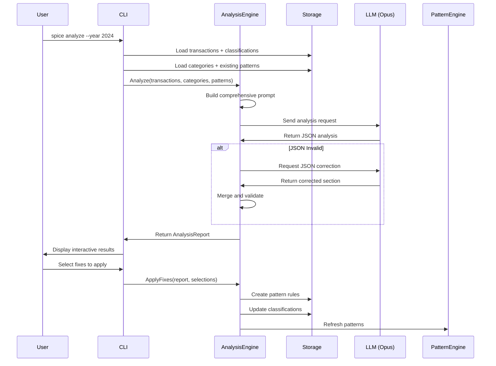

# AI-Powered Transaction Analysis Design

## Overview

This document describes the design for an AI-powered analysis system that examines an entire year of transaction data to:
- Identify categorization inconsistencies
- Discover patterns for automatic classification
- Suggest category optimizations
- Improve overall financial data coherence

## Goals

1. **Reduce Manual Work**: Let AI discover patterns rather than users writing rules
2. **Improve Coherence**: Fix split merchants and inconsistent categorizations  
3. **Optimize Categories**: Merge redundant categories, create missing ones
4. **Actionable Output**: Generate ready-to-apply pattern rules and fixes

## Architecture

### New Package Structure
```
internal/
  analysis/
    engine.go         # Core analysis orchestration
    session.go        # LLM session management
    validator.go      # JSON validation and recovery
    types.go          # AnalysisReport structs
    formatter.go      # Report display formatting
```

### Key Interfaces

```go
// AnalysisService performs AI-powered transaction analysis
type AnalysisService interface {
    // Analyze performs comprehensive analysis on transactions
    Analyze(ctx context.Context, opts AnalysisOptions) (*AnalysisReport, error)
}

// SessionStore manages analysis session persistence
type SessionStore interface {
    // CreateSession creates a new analysis session
    CreateSession(ctx context.Context, session *AnalysisSession) error
    
    // GetSession retrieves a session by ID
    GetSession(ctx context.Context, id string) (*AnalysisSession, error)
    
    // UpdateSession updates an existing session
    UpdateSession(ctx context.Context, session *AnalysisSession) error
}

// ReportValidator validates and corrects LLM JSON output
type ReportValidator interface {
    // Validate checks if JSON conforms to schema
    Validate(jsonData []byte) error
    
    // ExtractError returns the specific validation error details
    ExtractError(jsonData []byte, err error) *ValidationError
}

// FixApplier applies analysis recommendations
type FixApplier interface {
    // ApplyPatternFixes creates pattern rules from suggestions
    ApplyPatternFixes(ctx context.Context, patterns []SuggestedPattern) error
    
    // ApplyCategoryFixes applies category changes
    ApplyCategoryFixes(ctx context.Context, changes []CategorySuggestion) error
    
    // ApplyRecategorizations updates transaction categories
    ApplyRecategorizations(ctx context.Context, recats []Recategorization) error
}

// ReportFormatter formats analysis reports for display
type ReportFormatter interface {
    // FormatSummary creates the executive summary
    FormatSummary(report *AnalysisReport) string
    
    // FormatIssue formats a single issue for display
    FormatIssue(issue Issue) string
    
    // FormatInteractive creates the interactive menu
    FormatInteractive(report *AnalysisReport) string
}

// Dependencies for the analysis engine
type AnalysisDeps struct {
    Storage         service.Storage
    LLM             service.LLMClient
    SessionStore    SessionStore
    Validator       ReportValidator
    FixApplier      FixApplier
    Formatter       ReportFormatter
    PatternEngine   *engine.PatternClassifier
}

type AnalysisOptions struct {
    DateFrom    time.Time
    DateTo      time.Time
    Focus       []AnalysisFocus // Optional specific areas to analyze
    MaxPatterns int             // Limit number of patterns to discover
}

type AnalysisFocus string

const (
    FocusCoherence   AnalysisFocus = "coherence"
    FocusPatterns    AnalysisFocus = "patterns"
    FocusCategories  AnalysisFocus = "categories"
)
```

## Data Flow



## Go Type Definitions

```go
// AnalysisReport is the complete output from AI analysis
type AnalysisReport struct {
    Metadata             ReportMetadata        `json:"metadata"`
    Issues               []Issue               `json:"issues"`
    SuggestedPatterns    []SuggestedPattern    `json:"suggested_patterns"`
    CategorySuggestions  []CategorySuggestion  `json:"category_suggestions"`
    Recategorizations    []Recategorization    `json:"recategorizations"`
}

// ReportMetadata contains analysis session information
type ReportMetadata struct {
    TransactionCount int       `json:"transaction_count"`
    DateRange        string    `json:"date_range"`
    CoherenceScore   float64   `json:"coherence_score" validate:"min=0,max=100"`
    AnalysisVersion  string    `json:"analysis_version"`
    SessionID        string    `json:"session_id"`
    AnalyzedAt       time.Time `json:"analyzed_at"`
}

// IssueType represents the type of coherence issue found
type IssueType string

const (
    IssueTypeSplitMerchant   IssueType = "split_merchant"
    IssueTypeCategoryOverlap IssueType = "category_overlap"
    IssueTypeMiscategorized  IssueType = "miscategorized"
    IssueTypeMissingPattern  IssueType = "missing_pattern"
)

// IssueSeverity represents the importance of an issue
type IssueSeverity string

const (
    SeverityHigh   IssueSeverity = "high"
    SeverityMedium IssueSeverity = "medium"
    SeverityLow    IssueSeverity = "low"
)

// Issue represents a categorization problem found
type Issue struct {
    ID          string        `json:"id"`
    Type        IssueType     `json:"type"`
    Severity    IssueSeverity `json:"severity"`
    Description string        `json:"description"`
    Impact      IssueImpact   `json:"impact"`
    Evidence    []string      `json:"evidence"`
}

// IssueImpact quantifies the effect of an issue
type IssueImpact struct {
    TransactionCount int     `json:"transaction_count"`
    TotalAmount      float64 `json:"total_amount"`
    MonthlyAverage   float64 `json:"monthly_average"`
}

// SuggestedPattern represents a discovered pattern rule
type SuggestedPattern struct {
    ID              string          `json:"id"`
    Name            string          `json:"name"`
    MerchantPattern string          `json:"merchant_pattern"`
    IsRegex         bool            `json:"is_regex,omitempty"`
    AmountCondition string          `json:"amount_condition"`
    AmountValue     *float64        `json:"amount_value,omitempty"`
    AmountMin       *float64        `json:"amount_min,omitempty"`
    AmountMax       *float64        `json:"amount_max,omitempty"`
    Direction       *string         `json:"direction,omitempty"`
    Category        string          `json:"category"`
    Confidence      float64         `json:"confidence" validate:"min=0,max=1"`
    Rationale       string          `json:"rationale"`
    ImpactPreview   PatternImpact   `json:"impact_preview"`
}

// PatternImpact shows what would happen if pattern is applied
type PatternImpact struct {
    WouldMatch  int      `json:"would_match"`
    TotalValue  float64  `json:"total_value"`
    Examples    []string `json:"examples" validate:"max=3"`
}

// CategoryAction represents what to do with a category
type CategoryAction string

const (
    ActionMerge  CategoryAction = "merge"
    ActionCreate CategoryAction = "create"
    ActionDelete CategoryAction = "delete"
    ActionRename CategoryAction = "rename"
)

// CategorySuggestion represents a category optimization
type CategorySuggestion struct {
    ID                      string         `json:"id"`
    Action                  CategoryAction `json:"action"`
    Category                string         `json:"category,omitempty"`
    IntoCategory            string         `json:"into_category,omitempty"`
    NewName                 string         `json:"new_name,omitempty"`
    Reason                  string         `json:"reason"`
    ImpactTransactionCount  int            `json:"impact_transaction_count"`
    Confidence              float64        `json:"confidence" validate:"min=0,max=1"`
}

// Recategorization represents bulk category changes
type Recategorization struct {
    Merchant         string  `json:"merchant"`
    FromCategory     string  `json:"from_category"`
    ToCategory       string  `json:"to_category"`
    TransactionCount int     `json:"transaction_count"`
    Confidence       float64 `json:"confidence" validate:"min=0,max=1"`
    Reason           string  `json:"reason"`
}

// Validation methods
func (r *AnalysisReport) Validate() error {
    if r.Metadata.CoherenceScore < 0 || r.Metadata.CoherenceScore > 100 {
        return fmt.Errorf("coherence score must be between 0 and 100")
    }
    for _, pattern := range r.SuggestedPatterns {
        if err := pattern.Validate(); err != nil {
            return fmt.Errorf("invalid pattern %s: %w", pattern.ID, err)
        }
    }
    return nil
}

func (p *SuggestedPattern) Validate() error {
    if p.Confidence < 0 || p.Confidence > 1 {
        return fmt.Errorf("confidence must be between 0 and 1")
    }
    if p.AmountCondition == "range" && p.AmountMin == nil && p.AmountMax == nil {
        return fmt.Errorf("range condition requires at least one of amount_min or amount_max")
    }
    return nil
}
```

## LLM Prompt Structure

The prompt will be structured in clear sections:

1. **System Context**: Categories, existing patterns, analysis goals
2. **Transaction Data**: Full year in CSV format
3. **Analysis Instructions**: Specific tasks and output format
4. **JSON Schema**: Exact structure expected
5. **Validation Rules**: JSON formatting requirements

Key prompt engineering decisions:
- Emphasize returning ONLY valid JSON
- Provide examples of pattern rule formats
- Include confidence scoring guidelines
- Request specific evidence for each finding

## Session Management

```go
type AnalysisSession struct {
    ID              string
    StartedAt       time.Time
    LLMProvider     string
    LLMModel        string
    TransactionCount int
    DateRange       string
    Status          AnalysisStatus
    Report          *AnalysisReport
    ValidationTries int
    ErrorLog        []ValidationError
}

type AnalysisStatus string

const (
    StatusInProgress AnalysisStatus = "in_progress"
    StatusValidating AnalysisStatus = "validating"
    StatusComplete   AnalysisStatus = "complete"
    StatusFailed     AnalysisStatus = "failed"
)
```

Sessions are persisted to allow:
- Recovery from failures
- Validation iterations
- Audit trail of analyses
- Progress tracking for long-running analyses

## User Experience

### Interactive Flow

```
$ spice analyze --year 2024

🧠 Analyzing 1,511 transactions from 2024-01-01 to 2024-12-31...
⏳ This may take a few moments...

✅ Analysis complete! (Session: a3f4b2c1)

═══════════════════════════════════════════════════════════════
📊 FINANCIAL COHERENCE SCORE: 72/100
═══════════════════════════════════════════════════════════════

🔴 HIGH PRIORITY ISSUES (3)

[ISSUE-001] Amazon Categorization Chaos
├─ Impact: 67 transactions, $3,420.50
├─ Problem: Split across Shopping (40%), Groceries (25%), Office (20%), Other (15%)
└─ Fix: 4 pattern rules available

[ISSUE-002] Category Overlap: Food vs Groceries  
├─ Impact: 156 transactions, $2,100.00
├─ Problem: 89% overlap in merchant categorization
└─ Fix: Merge categories

[ISSUE-003] Uncategorized Subscriptions
├─ Impact: 48 transactions, $720.00/month
├─ Problem: Recurring charges in "Other" category
└─ Fix: Create "Subscriptions" category + 12 patterns

📋 QUICK ACTIONS

[1] Apply all HIGH confidence fixes (>90%)
[2] Review patterns individually  
[3] Show category optimization suggestions
[4] Export full report
[5] Enter interactive fix mode

Choice: _
```

### Progressive Disclosure

Start with summary → drill into details → apply fixes:
- Executive summary with coherence score
- Prioritized issues with impact metrics
- Expandable sections for patterns and evidence
- One-click bulk operations for high-confidence fixes

## Integration Points

### With Existing Systems

1. **Pattern System**: Generated patterns feed into `internal/pattern`
2. **Classification Engine**: Triggers pattern refresh after changes
3. **Storage Layer**: New tables for analysis sessions and reports
4. **CLI Commands**: New `spice analyze` command family

### Database Schema

```sql
-- Analysis sessions
CREATE TABLE analysis_sessions (
    id TEXT PRIMARY KEY,
    started_at TIMESTAMP NOT NULL,
    completed_at TIMESTAMP,
    status TEXT NOT NULL,
    transaction_count INTEGER,
    date_range TEXT,
    coherence_score REAL,
    report_json TEXT,
    error_log TEXT
);

-- Track which patterns came from analysis
ALTER TABLE pattern_rules ADD COLUMN source TEXT DEFAULT 'manual';
ALTER TABLE pattern_rules ADD COLUMN analysis_session_id TEXT;
```

## Implementation Plan

### Phase 1: Core Types and Interfaces
**Goal**: Define all types, interfaces, and data structures following Go best practices

- [ ] Create `internal/analysis/types.go` with all domain types
  - [ ] Define `AnalysisReport` struct with proper JSON tags
  - [ ] Define `Issue`, `SuggestedPattern`, `CategorySuggestion` types
  - [ ] Ensure no `interface{}` usage - all fields strongly typed
  - [ ] Add validation methods on types (e.g., `(r *AnalysisReport) Validate() error`)
  
- [ ] Create interface definitions in `internal/analysis/interfaces.go`
  - [ ] Keep interfaces small and focused (1-3 methods each)
  - [ ] Define `AnalysisService`, `SessionStore`, `ReportValidator`, etc.
  - [ ] Ensure interfaces are mockable for testing
  
- [ ] Set up dependency injection structure
  - [ ] Create `AnalysisDeps` struct for clean DI
  - [ ] Design for testability with interface dependencies
  
**Testing**: Create interface mocks and type validation tests

### Phase 2: Prompt Builder and LLM Integration
**Goal**: Build robust prompt generation and LLM communication

- [ ] Create `internal/analysis/prompt_builder.go`
  - [ ] Implement `PromptBuilder` struct with template management
  - [ ] Create method `BuildAnalysisPrompt(transactions []model.Transaction, categories []model.Category) string`
  - [ ] Use text/template for maintainable prompt construction
  - [ ] Include JSON schema in prompt with examples
  
- [ ] Create `internal/analysis/llm_client.go` 
  - [ ] Implement wrapper around existing LLM client
  - [ ] Add specific methods for analysis use case
  - [ ] Include retry logic with exponential backoff
  - [ ] Add request/response logging for debugging
  
**Testing**: Unit tests with prompt validation, integration tests with mock LLM

### Phase 3: JSON Validation and Session Management
**Goal**: Robust JSON handling and session persistence

- [ ] Create `internal/analysis/validator.go`
  - [ ] Implement `JSONValidator` using encoding/json and json-schema
  - [ ] Create `Validate(data []byte) (*AnalysisReport, error)` method
  - [ ] Implement `ExtractBadSection(data []byte, err error) (string, int, int)`
  - [ ] Add correction prompt builder for validation failures
  
- [ ] Create `internal/analysis/session.go`
  - [ ] Implement `SessionManager` with storage backend
  - [ ] Add methods: `Create`, `Get`, `Update`, `Delete`
  - [ ] Include session state machine (in_progress → validating → complete)
  - [ ] Add automatic cleanup of old sessions
  
- [ ] Create storage migrations for analysis tables
  - [ ] Add `analysis_sessions` table
  - [ ] Update `pattern_rules` with source tracking
  
**Testing**: Table-driven tests for various JSON malformations

### Phase 4: Analysis Engine Core
**Goal**: Implement the main analysis orchestration

- [ ] Create `internal/analysis/engine.go`
  - [ ] Implement `AnalysisEngine` struct with clean DI
  - [ ] Create `NewAnalysisEngine(deps AnalysisDeps) *AnalysisEngine`
  - [ ] Implement `Analyze(ctx context.Context, opts AnalysisOptions) (*AnalysisReport, error)`
  - [ ] Add transaction loading with efficient batching
  - [ ] Include progress callbacks for UI updates
  
- [ ] Add validation recovery loop
  - [ ] Maximum 3 attempts with different prompts
  - [ ] Save partial progress between attempts
  - [ ] Log all validation errors for debugging
  
**Testing**: Integration tests with full flow, error injection tests

### Phase 5: Report Formatter and Display
**Goal**: Beautiful, actionable report display

- [ ] Create `internal/analysis/formatter.go`
  - [ ] Implement `ReportFormatter` with lipgloss styling
  - [ ] Create formatted sections: Summary, Issues, Patterns, Actions
  - [ ] Add interactive menu builder
  - [ ] Include progress indicators for long operations
  
- [ ] Create display helpers
  - [ ] Coherence score visualization (progress bar)
  - [ ] Issue severity indicators (emoji/colors)
  - [ ] Pattern impact previews
  - [ ] Category relationship diagrams
  
**Testing**: Snapshot tests for formatted output

### Phase 6: Fix Application System  
**Goal**: Apply analysis recommendations safely

- [ ] Create `internal/analysis/fixer.go`
  - [ ] Implement `FixApplier` with transaction safety
  - [ ] Add `ApplyPatternFixes` with validation
  - [ ] Add `ApplyCategoryFixes` with merge logic  
  - [ ] Add `ApplyRecategorizations` with batch updates
  - [ ] Include rollback capability for each operation
  
- [ ] Add interactive selection UI
  - [ ] Pattern preview with affected transactions
  - [ ] Category merge confirmation with counts
  - [ ] Dry-run mode for all operations
  - [ ] Progress tracking for bulk operations
  
**Testing**: Transaction rollback tests, concurrent operation tests

### Phase 7: CLI Command Integration
**Goal**: Seamless CLI experience

- [ ] Create `cmd/spice/analyze.go`
  - [ ] Implement cobra command with flags
  - [ ] Add `--year`, `--from/--to`, `--focus` flags
  - [ ] Include `--dry-run` and `--auto-apply` modes
  - [ ] Add session continuation support
  
- [ ] Add progress and error handling
  - [ ] Real-time progress updates during analysis
  - [ ] Graceful handling of interrupts (save session)
  - [ ] Clear error messages with recovery instructions
  - [ ] Success summaries with next steps
  
**Testing**: CLI integration tests, user flow tests

### Phase 8: Testing and Polish
**Goal**: Production-ready quality

- [ ] Comprehensive test coverage
  - [ ] Unit tests for all components (>90% coverage)
  - [ ] Integration tests for full flows
  - [ ] Benchmarks for performance validation
  - [ ] Fuzz tests for JSON validation
  
- [ ] Performance optimization
  - [ ] Profile memory usage with large datasets
  - [ ] Optimize prompt size without losing context
  - [ ] Add caching for expensive operations
  - [ ] Parallel processing where applicable
  
- [ ] Documentation
  - [ ] Add examples to all public methods
  - [ ] Create user guide with screenshots
  - [ ] Document troubleshooting steps
  - [ ] Add architecture decision records (ADRs)

## Success Metrics

1. **Coherence Score Improvement**: Average score increases from ~70 to >85
2. **Manual Categorization Reduction**: 80% fewer manual categorizations needed
3. **Pattern Coverage**: >60% of transactions covered by patterns
4. **User Time Saved**: Annual categorization time reduced from hours to minutes

## Future Enhancements

1. **Scheduled Analysis**: Monthly/quarterly automatic analysis
2. **Trend Detection**: Identify spending pattern changes
3. **Anomaly Alerts**: Flag unusual transactions  
4. **Multi-User Patterns**: Learn from anonymized aggregate patterns
5. **Budget Integration**: Suggest budgets based on discovered patterns