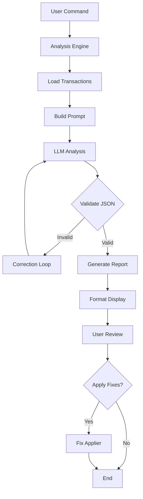

# AI Analysis Technical Reference

This document provides technical details about the AI analysis feature implementation in the spice-must-flow project.

## Architecture Overview

The AI analysis system is built with a modular architecture emphasizing testability, maintainability, and extensibility.

### Core Components

```
internal/analysis/
├── engine.go           # Main analysis orchestration
├── interfaces.go       # Small, focused interfaces
├── types.go           # Domain models and types
├── prompt_builder.go  # Template-based prompt generation
├── validator.go       # JSON validation and correction
├── llm_adapter.go     # LLM client abstraction
├── session_store.go   # Analysis session persistence
├── fixer.go          # Fix application logic
├── formatter.go      # Report formatting
└── templates/        # Prompt templates
```

## Key Interfaces

### AnalysisService

```go
type AnalysisService interface {
    Analyze(ctx context.Context, opts Options) (*Report, error)
}
```

The main entry point for transaction analysis.

### PromptBuilder

```go
type PromptBuilder interface {
    BuildAnalysisPrompt(data PromptData) (string, error)
    BuildCorrectionPrompt(original string, validationError error) (string, error)
}
```

Constructs prompts for the LLM using Go templates.

### ReportValidator

```go
type ReportValidator interface {
    Validate(data []byte) (*Report, error)
    ExtractError(data []byte, err error) (section string, line int, col int)
}
```

Validates LLM responses and extracts error context.

### FixApplier

```go
type FixApplier interface {
    ApplyPatternFixes(ctx context.Context, fixes []Fix) error
    ApplyCategoryFixes(ctx context.Context, fixes []Fix) error  
    ApplyRecategorizations(ctx context.Context, fixes []Fix) error
}
```

Applies recommended fixes to the database.

## Data Flow



## Implementation Details

### Prompt Generation

The system uses Go's `text/template` for maintainable prompt construction:

```go
// templates/analysis_prompt.tmpl
Analyze these {{.TotalCount}} financial transactions from {{.DateRange.Start | formatDate}} to {{.DateRange.End | formatDate}}.

Current Categories:
{{range .Categories}}
- {{.Name}} ({{.Type}}): {{.Description}}
{{end}}

Transactions to analyze:
{{range .Transactions}}
{{.Date | formatDate}} | {{.MerchantName}} | {{.Amount | formatAmount}} | Current: {{.Category}}
{{end}}
```

### Validation and Recovery

The validator implements a robust recovery mechanism:

1. **Initial Validation**: Strict JSON parsing with schema validation
2. **Error Extraction**: Identifies the specific location of JSON errors
3. **Correction Prompt**: Sends error context back to LLM for correction
4. **Retry Logic**: Up to 3 attempts with exponential backoff

```go
func (e *Engine) analyzeWithRetry(ctx context.Context, prompt string) (*Report, error) {
    for attempt := 1; attempt <= 3; attempt++ {
        response, err := e.llm.Analyze(ctx, prompt)
        if err != nil {
            return nil, err
        }
        
        report, err := e.validator.Validate(response)
        if err == nil {
            return report, nil
        }
        
        // Extract error context for correction
        section, line, col := e.validator.ExtractError(response, err)
        correctionPrompt := e.promptBuilder.BuildCorrectionPrompt(
            string(response), 
            fmt.Errorf("JSON error at line %d, col %d: %v", line, col, err),
        )
        
        prompt = correctionPrompt
    }
    
    return nil, ErrMaxRetriesExceeded
}
```

### Session Management

Analysis sessions are persisted to handle long-running analyses:

```go
type Session struct {
    ID          string    `json:"id"`
    StartedAt   time.Time `json:"started_at"`
    Status      Status    `json:"status"`
    ReportID    *string   `json:"report_id,omitempty"`
    Error       *string   `json:"error,omitempty"`
}
```

Sessions enable:
- Resuming interrupted analyses
- Tracking analysis history
- Debugging failed analyses

### Fix Application

Fixes are applied transactionally to ensure data integrity:

```go
func (f *TransactionalFixApplier) ApplyFixes(ctx context.Context, fixes []Fix) error {
    tx, err := f.storage.BeginTx(ctx)
    if err != nil {
        return err
    }
    defer tx.Rollback()
    
    for _, fix := range fixes {
        switch fix.Type {
        case "pattern":
            if err := f.applyPatternFix(ctx, tx, fix); err != nil {
                return err
            }
        case "category":
            if err := f.applyCategoryFix(ctx, tx, fix); err != nil {
                return err
            }
        case "recategorize":
            if err := f.applyRecategorizationFix(ctx, tx, fix); err != nil {
                return err
            }
        }
    }
    
    return tx.Commit()
}
```

## LLM Integration

### Prompt Structure

The analysis prompt includes:

1. **Context**: Date range, transaction count, existing categories
2. **Data**: Sampled transactions with all relevant fields
3. **Instructions**: Specific analysis requirements
4. **Schema**: Expected JSON response structure

### Response Schema

```json
{
  "coherence_score": 0.85,
  "issues": [
    {
      "type": "inconsistent",
      "severity": "high",
      "description": "AMAZON transactions split between Shopping and Entertainment",
      "affected_count": 45,
      "transaction_ids": ["txn_123", "txn_456"],
      "current_category": "Shopping",
      "suggested_category": "Entertainment",
      "confidence": 0.92
    }
  ],
  "suggested_patterns": [
    {
      "name": "Netflix Subscription",
      "merchant_pattern": "NETFLIX",
      "default_category": "Entertainment",
      "confidence": 0.98,
      "match_count": 12
    }
  ],
  "insights": [
    "Consider consolidating 'Dining' and 'Restaurants' categories",
    "High consistency in utility bill categorization"
  ]
}
```

### Token Optimization

To manage token usage:

1. **Sampling**: Analyze representative samples for large datasets
2. **Compression**: Remove redundant transaction data
3. **Batching**: Process transactions in optimal batch sizes
4. **Caching**: Cache analysis results for session continuity

## Testing Strategy

### Unit Tests

Each component has comprehensive unit tests:

```go
// 97.1% coverage for pattern_integration.go
func TestPatternClassifier_ClassifyWithPatterns(t *testing.T) {
    // Test with mock storage
    // Verify pattern matching logic
    // Check error handling
}
```

### Integration Tests

Full workflow tests ensure components work together:

```go
func TestAnalysisEngine_FullWorkflow(t *testing.T) {
    // Setup test database
    // Run analysis
    // Verify report generation
    // Test fix application
}
```

### Fuzz Testing

JSON validation is fuzz tested for robustness:

```go
func FuzzJSONValidator_Validate(f *testing.F) {
    // Test with malformed JSON
    // Verify no panics
    // Check error extraction
}
```

### Benchmarks

Performance benchmarks guide optimization:

```go
func BenchmarkPromptBuilder_BuildAnalysisPrompt(b *testing.B) {
    // Measure prompt generation performance
    // Test with varying transaction counts
}
```

## Configuration

### Environment Variables

```bash
# LLM Configuration
ANTHROPIC_API_KEY=your_api_key
OPENAI_API_KEY=your_api_key

# Analysis Settings
SPICE_ANALYSIS_MAX_TOKENS=8000
SPICE_ANALYSIS_TEMPERATURE=0.3
SPICE_ANALYSIS_BATCH_SIZE=100
```

### Database Schema

```sql
-- Analysis sessions table
CREATE TABLE analysis_sessions (
    id TEXT PRIMARY KEY,
    started_at TIMESTAMP NOT NULL,
    completed_at TIMESTAMP,
    status TEXT NOT NULL,
    error TEXT,
    report_id TEXT,
    options TEXT NOT NULL -- JSON
);

-- Analysis reports table  
CREATE TABLE analysis_reports (
    id TEXT PRIMARY KEY,
    session_id TEXT NOT NULL,
    generated_at TIMESTAMP NOT NULL,
    coherence_score REAL NOT NULL,
    report_data TEXT NOT NULL, -- JSON
    FOREIGN KEY (session_id) REFERENCES analysis_sessions(id)
);

-- Applied fixes tracking
CREATE TABLE applied_fixes (
    id TEXT PRIMARY KEY,
    report_id TEXT NOT NULL,
    applied_at TIMESTAMP NOT NULL,
    fix_type TEXT NOT NULL,
    fix_data TEXT NOT NULL, -- JSON
    success BOOLEAN NOT NULL,
    error TEXT,
    FOREIGN KEY (report_id) REFERENCES analysis_reports(id)
);
```

## Error Handling

### Error Types

```go
var (
    ErrNoTransactions      = errors.New("no transactions to analyze")
    ErrInvalidDateRange    = errors.New("invalid date range")
    ErrMaxRetriesExceeded  = errors.New("max retries exceeded")
    ErrSessionNotFound     = errors.New("session not found")
    ErrInvalidJSON         = errors.New("invalid JSON response")
)
```

### Recovery Strategies

1. **Transient Errors**: Exponential backoff with retry
2. **Validation Errors**: Correction loop with context
3. **Data Errors**: Graceful degradation with partial results
4. **System Errors**: Session persistence for recovery

## Performance Considerations

### Memory Usage

- **Streaming**: Process large datasets in chunks
- **Sampling**: Analyze representative samples
- **Cleanup**: Regular session and report cleanup

### Optimization Techniques

```go
// Pre-allocate slices for known sizes
transactions := make([]model.Transaction, 0, expectedCount)

// Use string builders for prompt construction
var promptBuilder strings.Builder
promptBuilder.Grow(estimatedSize)

// Cache compiled templates
templates := template.Must(template.ParseFS(templateFS, "templates/*.tmpl"))
```

## Security Considerations

### Input Validation

- Sanitize merchant names and descriptions
- Validate date ranges
- Limit batch sizes to prevent DoS

### API Key Management

- Never log API keys
- Use environment variables
- Implement key rotation support

### Data Privacy

- No PII in prompts
- Aggregate data where possible
- Clean session data regularly

## Extending the System

### Adding New Issue Types

1. Define the issue type in `types.go`:
```go
const IssueTypeNewType IssueType = "new_type"
```

2. Update validation logic in `validator.go`

3. Add detection logic in analysis prompt

4. Implement fix application in `fixer.go`

### Custom Formatters

Implement the `ReportFormatter` interface:

```go
type CustomFormatter struct{}

func (f *CustomFormatter) FormatSummary(report *Report) string {
    // Custom formatting logic
}

func (f *CustomFormatter) FormatIssue(issue Issue) string {
    // Issue-specific formatting
}
```

### Alternative LLM Providers

Implement the `LLMClient` interface:

```go
type CustomLLMClient struct{}

func (c *CustomLLMClient) Complete(ctx context.Context, req CompletionRequest) (string, error) {
    // Call custom LLM API
}
```

## Monitoring and Debugging

### Logging

Strategic logging points:

```go
slog.Info("starting analysis",
    "session_id", session.ID,
    "date_range", opts.DateRange,
    "transaction_count", len(transactions))

slog.Debug("prompt generated",
    "token_count", tokenCount,
    "batch_size", batchSize)

slog.Error("analysis failed",
    "error", err,
    "attempt", attempt,
    "session_id", session.ID)
```

### Metrics

Key metrics to track:

- Analysis duration
- Token usage per analysis
- Fix application success rate
- Error rates by type
- Coherence score trends

### Debug Mode

Enable verbose output:

```go
if opts.Debug {
    slog.SetLogLoggerLevel(slog.LevelDebug)
    // Log prompts and responses
    // Save intermediate results
}
```

## Future Enhancements

### Planned Features

1. **Real-time Analysis**: Analyze transactions as they're imported
2. **Custom Rules**: User-defined analysis rules
3. **Multi-language Support**: Analyze non-English transactions
4. **Collaborative Fixes**: Share fix recommendations

### Performance Improvements

1. **Parallel Processing**: Analyze multiple batches concurrently
2. **Result Caching**: Cache analysis for similar transactions
3. **Incremental Analysis**: Only analyze new/changed transactions

### Integration Opportunities

1. **Webhooks**: Notify external systems of issues
2. **API Endpoints**: Expose analysis via REST API
3. **Scheduled Analysis**: Automatic periodic analysis
4. **Export Formats**: Additional report formats (PDF, CSV)